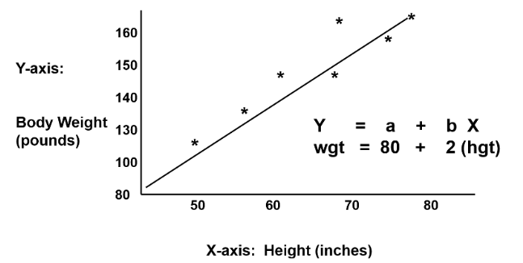
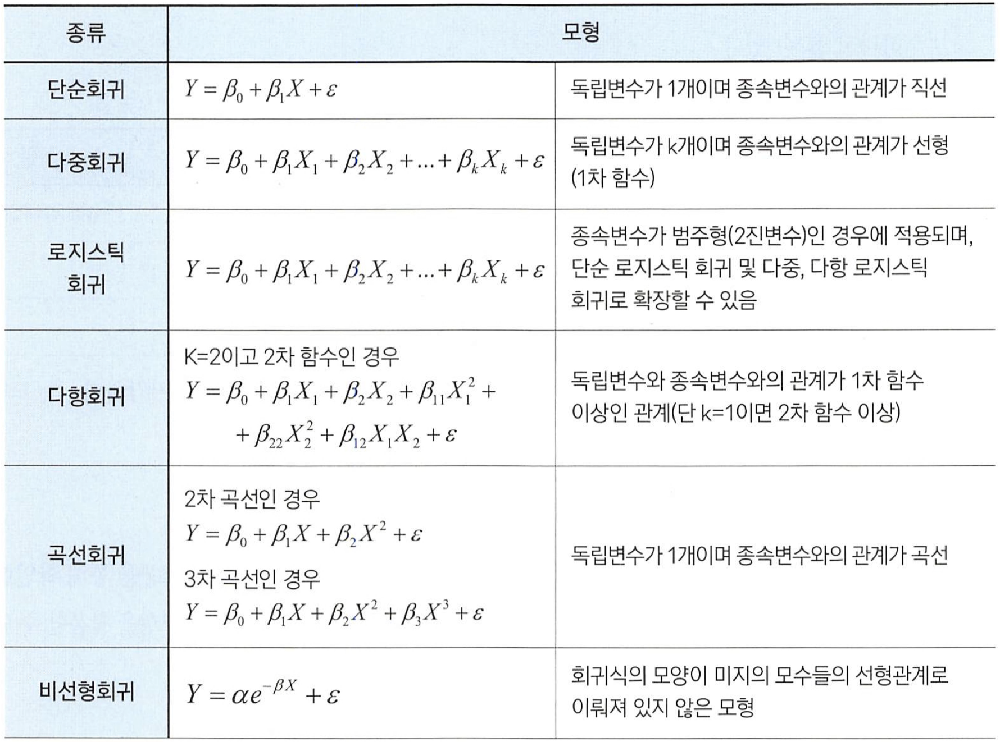

# 회귀분서 개요
대표적인 상태를 토대로 미래의 어떤 결과를 예측하는 분석

## #01. 회귀분석(Regression Analysis)의 이해

1. 회귀분석의 의미

하나나 그 이상의 독립변수들이 종속변수에 미치는 영향을 추정할 수 있는 통계기법

규명된 함수식을 이용해 설명 변수들의 변화로부터 종속변수의 변화를 예측하는 분석

독립변수 X(설명변수)에 대하여 종속변수 Y(반응변수)들 사이의 관계를 수학적 모형을 이용해 규명하는 것.

$y=f(x)$ 일 때, 함수 $f$를 규명하여 독립적인 값 $x$에 따라 $y$가 어떻게 변화하는지를 예측하는 것

변수들 사이의 인과 관계를 밝히고 모형을 적합하여 관심있는 변수를 예측하거나 추론하기 위한 분석방법.

2. 회귀분석의 변수

**영향을 받는 변수 (y)**

반응변수, 종속변수, 결과 변수

**영향을 주는 변수 (x)**

설명변수, 독립변수, 예측변수

## #02. 회귀분석 예시

### 키에 따른 몸무게

$Weight = a + b\times Heights$

| 변수 | 내용 |
| -- | -- |
| Wiehgt | Height에 따라 결정되므로 종속변수 |
| Height | Weight를 결정하는 요인이 되므로 독립변수 |
| b | 기울기(선의 경사도).   기울기 크기가 클 수록 선이 더 경사지고 변화율이 더 커진다 |
| a | 절편 (선과 y축이 교차하는 위치) |

## #03. 회귀분석의 조건

| 조건 | 설명 |
| -- | -- |
| 선형성 | `입력변수와 출력변수의 관계가 선형이다.` (선형회귀 분석에서 가장 중요한 가정) |
| 등분산성 | 오차의 분산이 입력 변수와 무관하게 일정하다. |
| 정규성 | 오차의 분포가 정규분포를 따른다.   Q-Q Plot, Kolmogolov-Smirnov 검정, Shapiro-Wilk 검정 등을 활용해 정규성을 확인 |
| 독립성 | 입력 변수와 오차는 관련이 없다.   자기상관 (독립성을 알아보기 위해 Durbin-Watson 통계량을 사용) |

## #04. 회귀분석 종류

## #05. 회귀분석의 검정

1. 예측변수(회귀계수)들이 유의미한가?
- 각 독립변수($x$)의 회귀계수($b$)가 유의한가?
- t-검정을 사용
- 해당 계수의 t 통계량의 p=값이 0.05보다 작으면 해당 회귀계수가 통계적으로 유의하다고 볼 수 있다.

2. 모형이 얼마나 설명력을 갖느가?
- 만들어진 회귀모형(예측모형)이 유의한가?
- 주어진 모든 변수들이 함께 어느 정도 예측변수의 변랴을 설명(예측)하는가?
- 결정계수($R^2$)를 확인한다. 결정계수는 0~1 값을 가지며, 높은 값을 가질수록 추정된 회귀식의 설명력이 높다.

3. 모형이 데이터를 잘 적합하고 있는가?
- 잔차를 그래프로 그리고 회귀진단을 한다.
