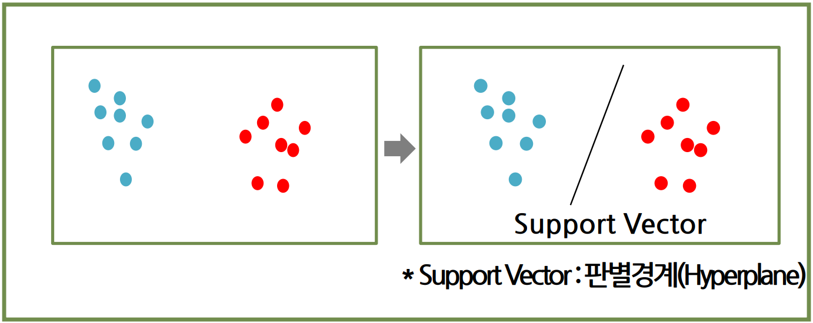
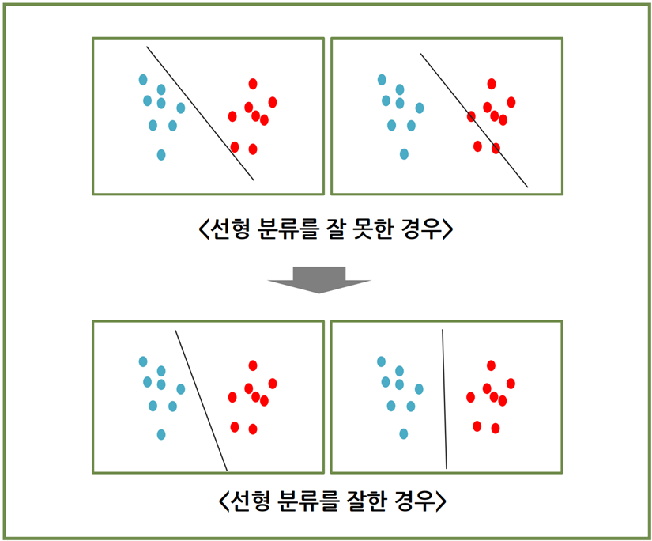
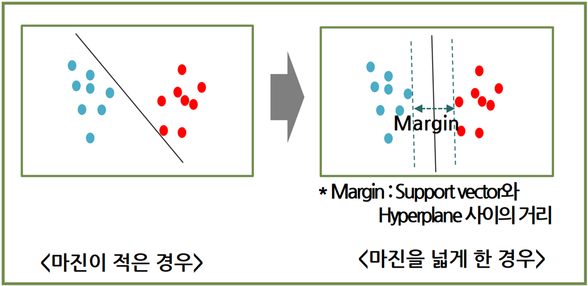
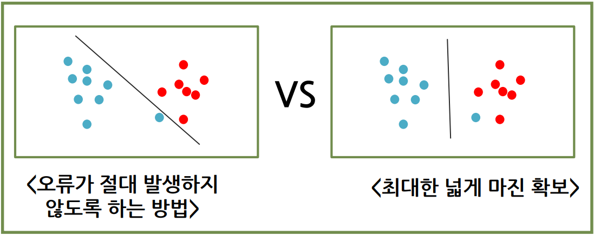
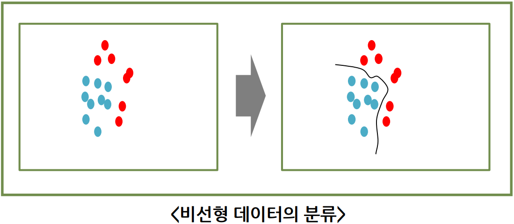
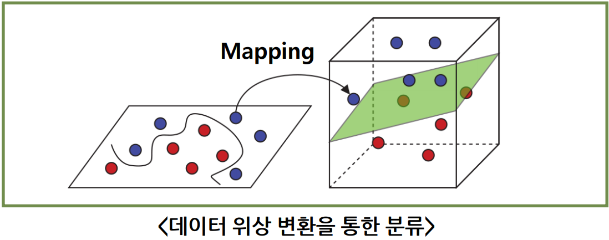

# SVM (Support Vector Machine)

N차원의 공간을 (N-1)차원으로 나눌 수 있는 **초평면(Hyperplane)**을 찾는 분류 기법

분류나 회귀 문제를 해결하기 위해 사용하는 `지도학습` 알고리즘(주로 분류에서 사용)

## 초평면

- 직선 : 2차원의 초평면
- 평면 : 3차원의 초평면

## 선형 분류

평면 상태에서 초평면에 의해 분류가 가능한 상태

### 어느 것이 잘 분류한 것인가?

- 어느 한 쪽에 치우치지 않게 분류
- 공통되는 빈 공간의 경우에도, 양쪽 데이터와 균증한 위치에 기준을 세움

### 마진

분류 기준선과 데이터간의 여유 거리

SVM은 최고의 마진을 가져가는 방법으로 분류 기준을 구축

비어있는 마진이 많아야 새로운 데이터가 투입되어도 분류가 잘 될 가능성이 높음

## 장단점

### 장점

- 범주나 수치 예측에 사용 가능
- 이상치에 영향이 적음
- 과적합이 발생하는 경우가 적음
- SVM 알고리즘이 신경망보다 사용하기 쉽게 구성된 것이 많음

### 단점

- 최적의 모델을 찾기 위해서 커널과 모델에 대한 다양한 조합 테스트가 필요
- 입력 데이터 셋이 클 수록 학습 속도가 느려질 수 있다
- 다소 해석이 복잡

## SVM의 일반화 적용

일부 오류를 감안할 것인가? 최적의 마진을 목표로 할 것인가?

### 마진이 넓은 것을 최우선으로 삼는 경우(데이터 일반화)

- 일부 오류가 발생할 수 있음
- 새로 들어오는 데이터에 대해서는 마진이 넓어 잘 분류될 가능성이 높음

### 오류 가능성을 최소화 하는 경우

- 오류 발생 가능성은 거의 없음
- 새로 들어오는 데이터에 대해서는 마진이 좁아서 분류가 잘못될 가능성이 존재

## 비선형 데이터

초평면으로 데이터가 일정하게 나누어져 있지 않은 경우

하나의 직선으로는 분류가 불가능한 형태

### 위상 변화를 통한 초평면 분류

데이터의 위상을 변화하여 초평면에 의한 분류가 가능하도록 함

구별이 가능한 방향으로 Mapping 시키면 새로운 공간 영역으로 변환

새로 생성된 공간 영역에서는 초평면 분류가 가능해 짐

X, Y 기준의 2차원 평면상에서 선형으로 구분이 불가능한 데이터라면 Mapping 함수를 활용해 3차원으로 변경