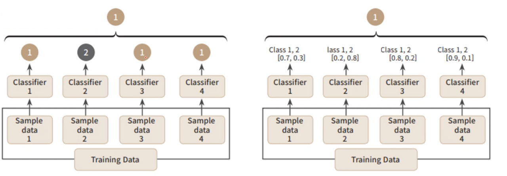
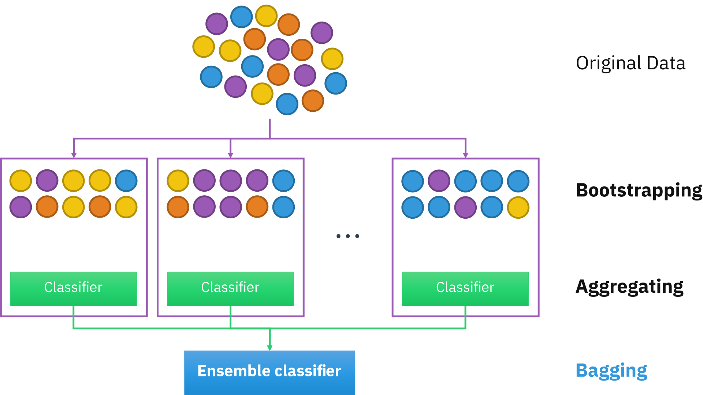
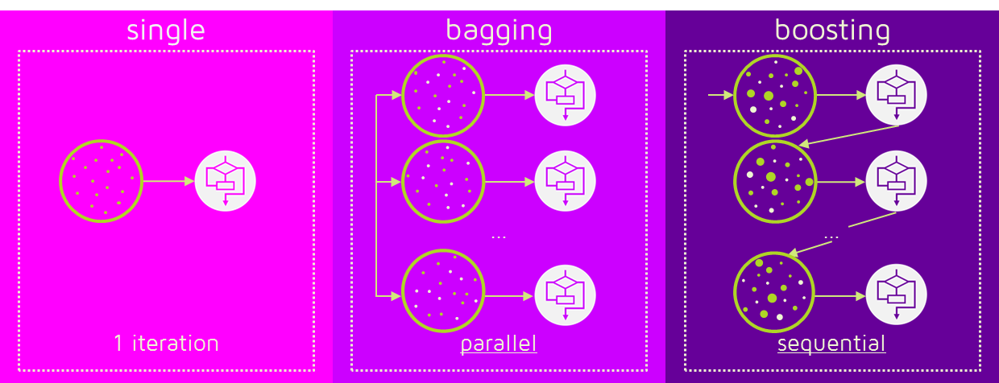

# 앙상블 학습(Ensemble Learning)

일반적으로 단일 학습 모델을 사용하면 충분한 성능을 확보하기 어렵다.

여러 개의 학습 모델을 생성하고 그 예측을 결합함으로써 보다 정확한 최종 예측을 도출하는 기법.

## 앙상블 학습 유형

### 보팅(Voting)

다양한 알고리즘을 사용.(ex:로지스특+KNN).

각각의 알고리즘이 원본 데이터(전처리, 라벨링이 끝난 입력 파라미터)를 그대로 사용.

#### 보팅 방식 구분

#### Hard Votting(좌측 그림)

각 서브 샘플에서 예측된 값을 종합하고 최빈값으로 최종 예측값을 결정함.

각각의 알고리즘이 예측한 결과값에서 다수결로 결정된 값을 최종 결정값으로 정하는 방식.

#### Soft Votting

각 서브 샘플에서 확률을 계산하고, 각 확률 값을 통해서 최종 예측값을 결정함.

#### Sklearn에서 지원하는 Voting 알고리즘

- VotingClassifier
- VotingRegressor

### 배깅(Bagging)

Bootstrap Aggregation의 약자.

샘플를 여러 번 뽑아(Bootstrap) 각 모델을 학습시켜 결과물을 집계(Aggregation)하는 방법.

하나의 학습 모델이 서로 다른 sub-sample data로 학습을 수행하는 방식.

학습 데이터에서 sub-sampling을 진행해서 여러 개의 하위 샘플을 생성하고, 각 샘플들에 대해서 예측을 진행해 결과를 종합하기 때문에 과적합 가능성이 감소하고 모델의 일반화 가능성이 증가한다는 장점이 있으나 비교적 느림.

#### Sklearn에서 지원하는 Bagging 알고리즘

- BaggingClassifier
- BaggingRegressor
- RandomForestRegressor

### 부스팅(Boosting)

**가중치**를 활용해 약 분류기를 강 분류기로 만드는 방법.

여러 개의 분류기가 순차적으로 학습을 수행.

앞에서 학습한 분류기의 예측 결과에 따라 다음 분류기에 가중치가 부여된다.

처음 도델이 예측을 하면 그 예측 결과에 따라 데이터에 가중치가 부여되고, 부여된 가중치가 다음 모델에 영향을 준다. 잘못 분류된 데이터에 집중해 새로운 분류 규칙을 만드는 단계를 반복한다.

#### Sklearn에서 지원하는 Boosting 알고리즘

- AdaBoostClassifier
- AdaBoostRegressor
- GradientBoostingClassifier
- GradientBoostingRegressor

> XGBoost와 LightGB는 sklearn에서 지원하지 않기 때문에 별도의 라이브러리를 사용

## 비교

- single : 지금까지 살펴본 개별 알고리즘.
- bagging : 두 개 이상의 알고리즘이 병렬로 작동.
- boosting : 순차적으로 학습하면서 한 번 학습이 끝난 후 결과에 따라 다음 학습 모델에 영향을 줄 수 있는 가중치를 부여함.

- boosting
    - 배깅에 비해 에러가 적음. 즉, 분류 성능이 좋다.
    - 단, 속도가 느리고 오버피팅 가능성이 있음.

> 머신러닝은 정확성을 우선하는 만큼 속도가 느려도 boosting을 사용함