# 텐서플로우 소개

구글에서 공개한 오픈소스 딥러닝 라이브러리.

인공신경망(딥러닝)을 기반으로 하는 머신러닝 기법을 제공한다.

## #01. 인공신경망의 구조

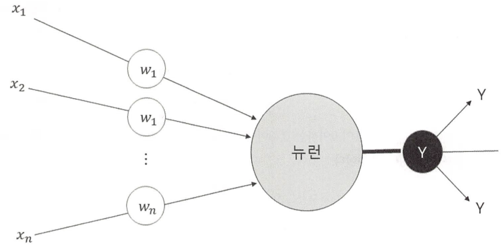

- 여러 개의 입력을 받아서 계산하고，출력을 만들어 낸다.

- 입력값 미가공 데이터 또는 다른 출력 값이 될 수 있다.

- 출력신호는 문제의 최종적인 해(solution)가 되거나 다른 뉴런에 입력 될 수 있다.

## #02. 가중치(weight)와 편향(bias)

### 1) 가중치의 이해 → 파티에 가기 위한 조건 3가지

| 조건 | 중요도 |
|---|---|
| 날씨가 맑은가? | 2 |
| 절친 A가 같이 가는가? | 3 |
| 알바비가 입급 되었는가? | 10 |

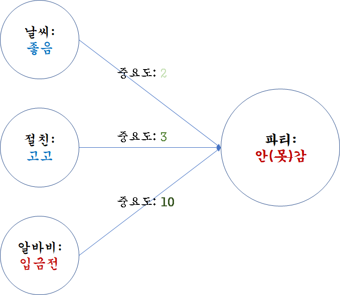

#### 알바비가 입금되었다면? 혹은 입금되지 않았다면?

- 파티의 입장권 금액이 고가일 경우 날씨나 친구의 동행 여부보다 알바비 입금 여부가 파티에 갈 수 있는지를 결정하는 더 중요한 요인이 된다.

- 결국 파티의 참석(`1`)과 불참석(`0`)을 결정하기 위한 조건값들에는 일정한 가중치가 곱해져야 공평한 조건 비교가 될 것이다.

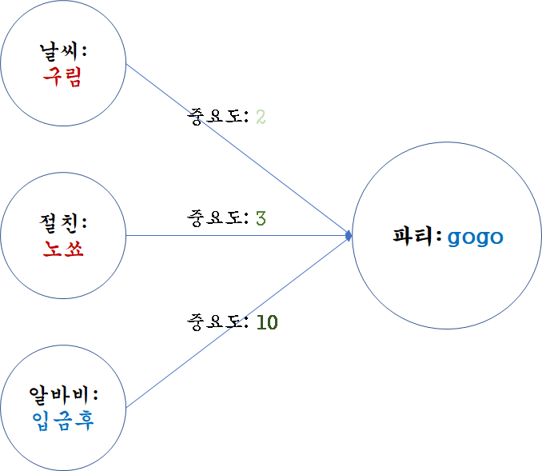
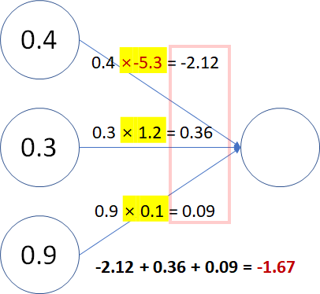

### 2) 편향

파티에 참석하는 것을 좋아하는 성향을 가진 A와 싫어하는 성향을 가진 B가 있을 때 이들의 3가지 요인(조건)과 중요도(가중치)가 완전이 동일하다고 가정.

#### A의 경우 (참석하는 것을 좋아하는 성향)

알바비가 입금되지 않아 파티에 참석 하지 못하는 결과값이 도출되더라도 각종 핑계를 대서 파티에 참석하려고 함

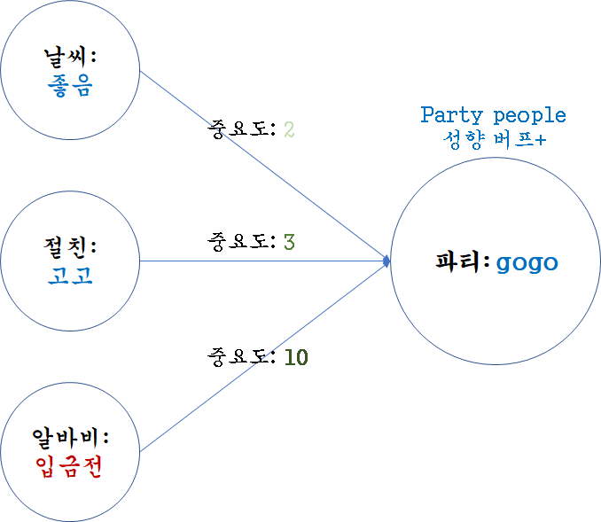

#### B의 경우 (싫어하는 성향)

알바비가 입금되어 파티에 참석할 수 있더라도 각종 핑계를 대서 파티에 참석하지 않으려고 함.

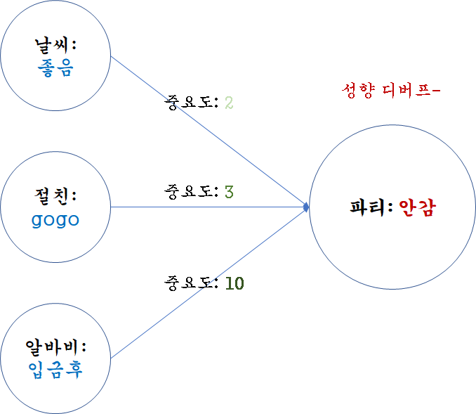

### 3) 정리

1. 인공신경망의 결과값(파티 참석 여부)로 출력되는 것은 일종의 의사결정 과정.
2. 그 결과는 각 요인에 곱해지는 `weight`와 `bias`에 의해 결정된다.
3. 머신 러닝의 궁극적 목표는 결국 여러 독립변수들로부터 하나의 (혹은 하나 이상의) 종속 변수에 도달하는데 필요한 가중치와 편향을 찾는 것!!!!

## #03. 뉴런과 활성화 함수의 이해

### 1) 뉴런

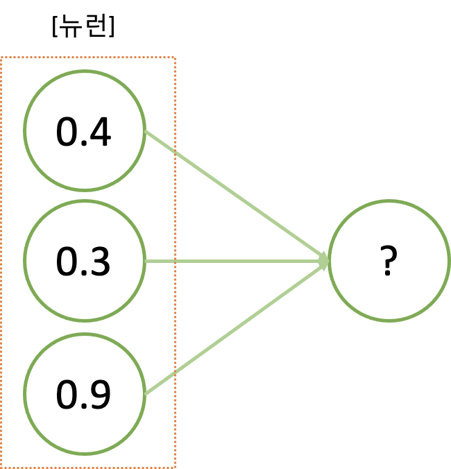

- 뉴런은 그냥 `0`~`1` 사이의 어떤 숫자.
- (위 그림에서) 위치한 `0.4` , `0.3` , `0.9` 의 조합에 따라 오른쪽 뉴런 `?` 의 값이 결정된다.
- 여기서 화살표 실선의 역할이 중요.
- 화살표 실선은 어떤 실수(REAL NUMBER)를 의미함 .
- 이 실수는 `+` 값일 수도 있고, `-` 값일 수 도 있다.
- 이 실수를 가중치 `weight` 라고 부른다.

#### 가중치(`weight`)를 어떤 규칙도 없이 임의로 결정한 경우


뉴런의 값과 `weight`의 값을 곱한 결과를 모두 합한 결과에 임의의 값 편향을 더한 결과가 `?`의 값이 된다.

편향은 있을 수도 있고, 없을 수도 있다.

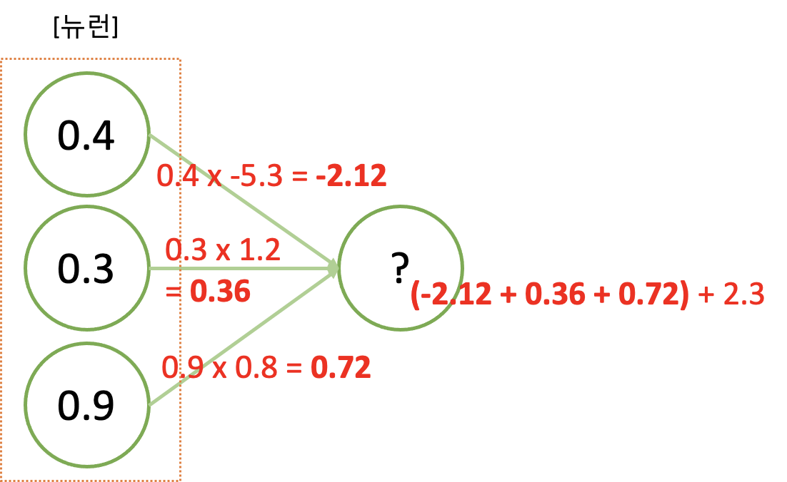

위의 그림에서 `?` 의 결과값은 $(-2.12+0.36+0.72)+2.3$ 이 나오기 때문에 뉴런은 `0 ~ 1` 사이의 숫자라는 맨 처음 가정에 위배된다.

그러므로 이 결과값은 `어떠한 처리`를 거쳐 `0 ~ 1` 사이의 값으로 변환되어야 한다.

### 2) `어떠한 처리` = 활성화 함수

가중치나 편향은 특별한 제약 없이 모든 Real Number가 될 수 있으므로 무한대에 가까운 양수나 실수 가 될 수도 있다.

그러므로 계산한 결과값이 `0 ~ 1` 사이의 값이라는 조건에 위배되는 것이 매우 쉽다.

활성화 함수는 계산한 결과값을 파라미터로 전달해서 `0 ~ 1` 사이의 값으로 변환하여 리턴한다. 

활성화 함수는 파라미터값을 변환한 후에도 상대적인 크기가 유지되어야 한다.

`a`, `b`, `c`가 크기 순서대로 `a` > `b` > `c` 라고 한다면 a, b, c를 활성화 함수에 전달하여 반환 받은 결과도 이러한 크기 순서가 유지되어야 한다.

즉, 활성화 함수는 모든 $x$에 대해 항상 우상향이다.

### 3) 정리

1. 동그라미(뉴런)의 값과 화살표(weight)의 값을 곱한다.
2. 곱한 값을 모두 더한다.
3. 여기에 편향(bias)를 더한다. -> 결과값 $k$
4. 그 결과값 $k$를 `0 ~ 1` 사이의 값으로 만들어 주는 함수 $f(x)$에 전달한다.

위 과정에서 결과값 $k$를 `activation`이라고 하고 `0 ~ 1`사이의 값으로 변환해 주는 함수 $f(x)$를 활성화 함수(activation function)이라고 한다.

앞에서 전제한 "뉴런은 그냥 `0 ~ 1` 사이의 어떤 숫자."라 함은 이전 층의 뉴런으로부터 처리된 $k$(`activation`)값

#### 뉴런의 계산

- 뉴런은 `활성화 함수(activation function)`를 이용해 출력을 결정하며 입력신호의 가중치 합을 계산하여 임계값과 비교한다.
- 가중치 합이 임계값보다 작으면 뉴런의 출력은 `-1` ，같거나 크면 `+1`을 출력한다.

$$X = \sum_{i=0}^{n}x_iw_i\\Y = \begin{cases}+1 \,\,\,\,\,\,\,\, if  \,\,x \geq \theta\\-1 \,\,\,\,\,\,\,\, if \,\, x < \theta\end{cases}$$

- $X$는 뉴런으로 들어가는 입력의 순 가중합
- $w_i$는 입력 $i$ 가중치
- $n$은 뉴런의 입력 개수
- $Y$는 뉴런의 출력
- $x_i$는 입력 $i$의 값

## #04. 활성화 함수의 종류

### 1) 선형(linear)함수

- 단층 퍼셉트론에서 사용.
- linear 함수를 제외한 모든 활성화 함수는 비선형 활성화 함수임.

### 2) 시그모이드(sigmoid) 함수

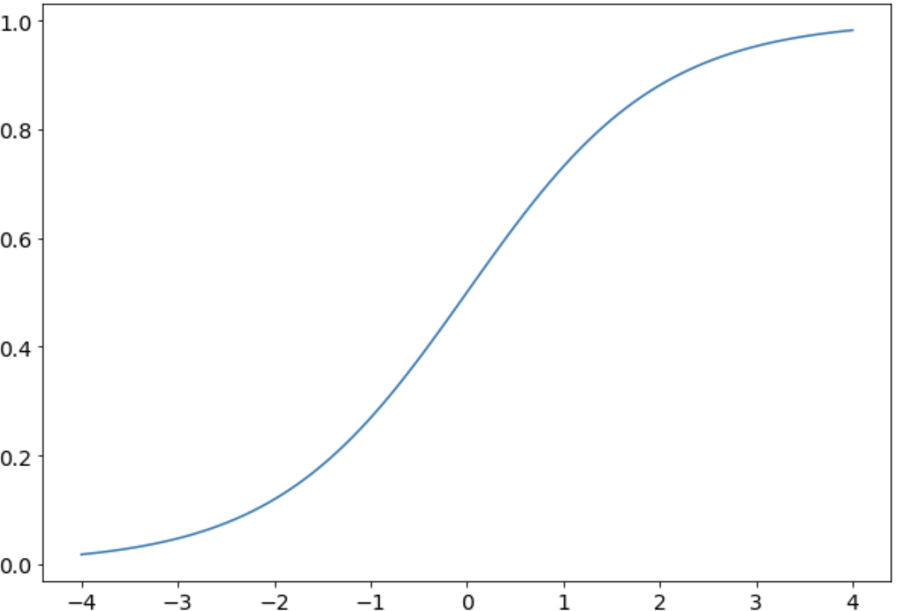

- 로지스텍 회귀 분석과 유사
- `0~1` 사이의 확률값을 갖는다.
- 이진분류(binary classification)의 출력층 노드에서 `0~1`사이의 값을 만들고 싶을때 사용한다.
- 단점: input값이 너무 크거나 작아지면 기울기가 거의 0이 된다.

### 3) 하이퍼볼릭 탄젠트 함수

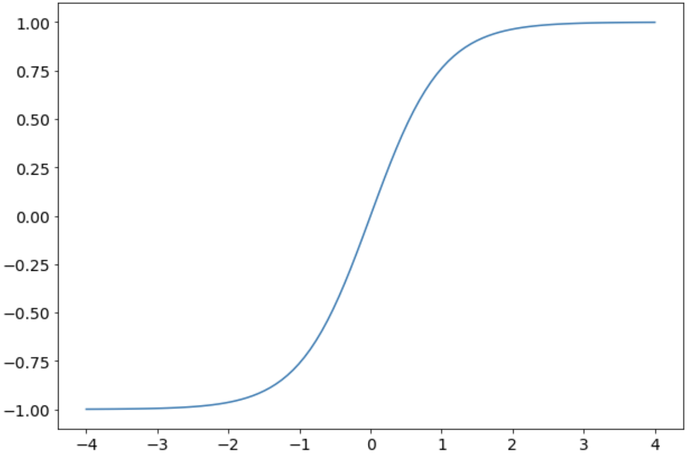

- 시그모이드 함수의 크기와 위치를 조절(rescale and shift)한 함수.
- 범위는 `[−1,1]`
- 그래프의 모양은 `0`을 기준으로 대칭임
- 이 때문에 하이퍼볼릭탄젠트는 시그모이드를 활성화 함수로 썼을 때보다 학습 수렴 속도가 빠름.

### 4) 소프트맥스(softmax) 함수

- 표준화지수 함수로도 불림.
- 출력값이 여러 개로 주어지고 목표치가 다범주인 경우 각 범주에 속할 확률을 제공하는 함수.
- 카테고리 분류에 사용

$$y_i = \frac{exp(z_j)}{\sum_{i=1}^{n}exp(z_i))},j=1, ..., L$$

### 5) 리루(relu) 함수

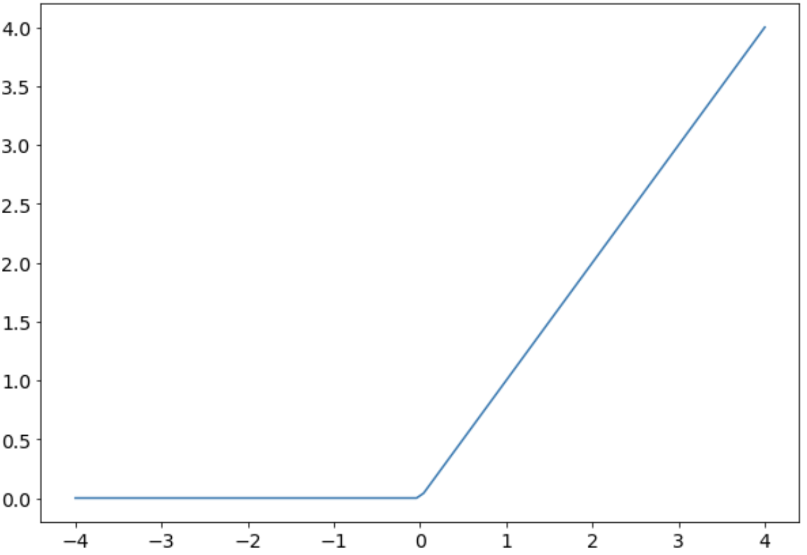

- 입력값 $x$가 `0` 이하일 때는 `0`, `0` 초과일 때는 $x$값을 가지는 함수
- 최근 딥러닝에서 많이 활용.

$$Y^{relu} = \begin{cases}0 \,\,\,\,\,\,\,\, if  \,\,x \leq \theta\\x \,\,\,\,\,\,\,\, if \,\, x > \theta\end{cases}$$

- 대부분의 경우 일반적으로 ReLU의 성능이 가장 좋기 때문에 ReLU를 사용함.
- "어떤 활성화 함수를 사용할지 모르겠으면 ReLU를 사용하면 된다" - Andrew ng
- 대부분의 input값에 대해 기울기가 0이 아니기 때문에 학습이 빨리 된다.

## #05. 손실함수의 이해

머신러닝, 딥러닝은 결국 컴퓨터가 독립변수로부터 종속변수에 도달하기 위한 가중치와 편향을 찾는 과정.

```python
2a + b = 3
3a + b = 7
4a + b = 9
9328742946a + b = 18,657,485,893
```

위와 같은 문제가 있을 때 컴퓨터는 a와 b를 찾기 위해 값을 직접 대입해 가면서 문제를 푼다.(노가다)

대립한 결과값과 실제 정답간의 간격(=오차, loss)을 최대한 줄이는 방향으로 값을 찾아간다.

컴퓨터가 선정한 임의의 a, b를 대입한 결과값이 실제 값에 근사하게 접근하도록 적용하는 특정 함수를 손실함수라고 한다.

머신러닝이 학습을 통해 찾아낸 a를 활용하여 구성된 회귀식이 실제 정답과의 차이가 거의 없도록 보정하기 위해 다음번에 적용할 a값을 찾기 위해 사용하는 수학 함수

### 경사하강법 이해하기

- 1차 방정식의 근삿값을 발견하기 위한 최적화 알고리즘(=수학식)
- 신경망은 가중치를 업데이트(a를 끊임없이 바꾸어 가면서 결과값을 예측)하면서 주어진 문제를 최적화한다.
- 가중치를 업데이트하는 대표적인 방법이 경사하강법 Gradient Descent이다.
- 경사하강법은 특정 함수에서의 미분을 통해 얻은 기울기를 이용하여 최적의 값을 찾아가는(손실을 줄이는) 방법이다.

### $y = x^2$에 대한 경사하강법


- 그림 안의 수식에서 `lr(learning rate)`로 표현되고 있는 학습률을 사용하고 있다.
- 학습률은 모델의 학습에서 학습 속도나 성능에 큰 영향을 끼치는 중요한 하이퍼파라미터이다.
- 어느 지점에서 출발해도 경사를 따라가다 보면 최적값을 만날 수 있다.

### 손실함수의 종류

#### 회귀 분석

- MSE (평균 제곱 오차), MAE (평균 절대 오차)

#### 이진 분류

- binary crossentropy (이항 교차 엔트로피)

#### 다중 분류

- sparse categorical crossentropy (범주형 교차 엔트로피)

## #06. Optimizer

최적화 알고리즘 혹은 학습 알고리즘

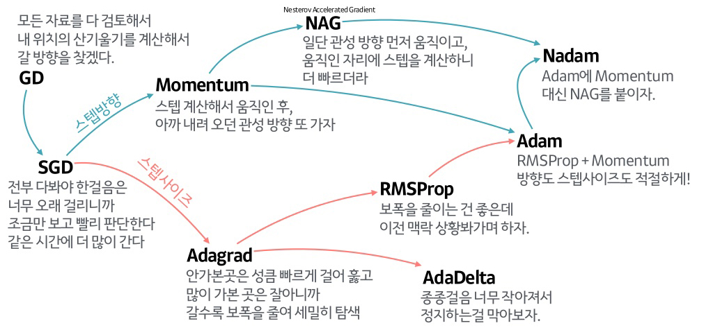

> 잘 모르겠으면 "Adam" ~!!!


## #07. Tensorflow 지도학습 구성

| 구분 | 모델 | 활성화 함수 | 옵티마이저 | 손실함수 | 평가지표 | 대표예제 |
|--|--|--|--|--|--|--|
| 논리연산 | 단층퍼셉트론 | linear | SGD | mse | acc | OR, AND Gate |
| 논리연산 | 다층퍼셉트론 | relu, sigmoid | RMSprop | mse | acc | XOR Gate |
| 회귀 | 단순선형회귀 | relu, linear | adam | mse | mae | |
| 회귀 | 다중선형회귀 | relu, relu, linear | adam | mse | mae | 보스턴 집값 예측 |
| 분류 | 이항분류(로지스틱 회귀) | [relu,] sigmoid | rmsporp | binary_crossentropy | acc | 타이타닉 생존률 예측 |
| 분류 | 다항분류(소프트맥스 회귀) | [relu, ...] softmax | adam 혹은 rmsprop | categorical_crossentropy | acc | iris 분류 |